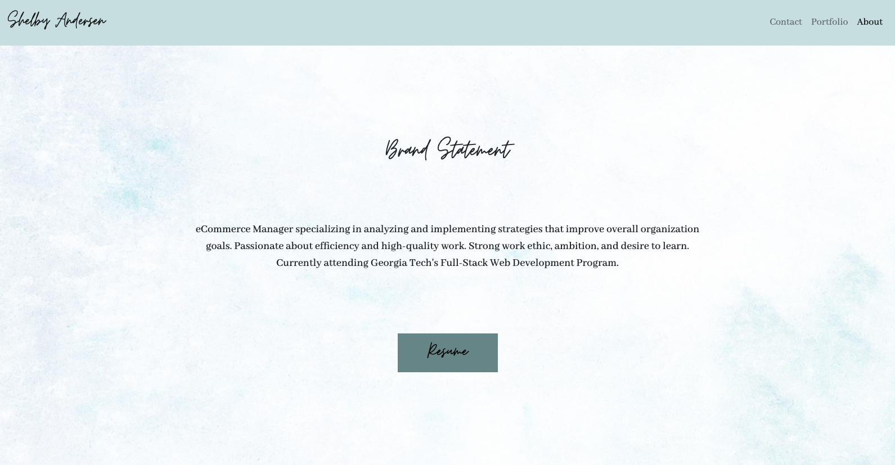

# React Portfolio

## Description

This project showcases a responsive website using the Twitter Bootstrap Framework. The website has three main sections that include an about me section, a portfolio section, and a contact section. Each page is accessible through the navigation. The main logo is linked to the about me section.

Final Website Link: https://shelbyandersen.github.io/react-portfolio/

## Overview

about me section - this section utilizes Bootstraps container, row, and column grid system to display data on either side of the page.

contact section - the contact section has input fields for a user to enter their name, email, and a message. There is also a submit button. This contact form currently does not work yet, but will be connected to a database in the future.

portfolio section - the portfolio page is designed to showcase snippets of specific projects completed.

This website is responsive for desktop, tablet, and mobile screen sizes. Twitter Bootstrap's grid system was utilized.

## Installation

The code for the Responsive Portfolio can be found on github using the following link: https://github.com/shelbyandersen/react-portfolio

## Usage

The Responsive Portfolio Update has an index.html file and a style.css file. There are also multiple asset images that are used for the background image, profile picture, and the portfolio image placeholders.

Code will need to be taken from the repo on github and changes can be made:

https://github.com/shelbyandersen/react-portfolio

## Credits

Portions of this website used Twitter Bootstrap's framework.

The website was designed and coded by Shelby Andersen

## License

MIT License

Copyright (c) [2020] [Shelby Andersen]

Permission is hereby granted, free of charge, to any person obtaining a copy of this software and associated documentation files (the "Software"), to deal in the Software without restriction, including without limitation the rights to use, copy, modify, merge, publish, distribute, sublicense, and/or sell copies of the Software, and to permit persons to whom the Software is furnished to do so, subject to the following conditions: The above copyright notice and this permission notice shall be included in all copies or substantial portions of the Software.

THE SOFTWARE IS PROVIDED "AS IS", WITHOUT WARRANTY OF ANY KIND, EXPRESS OR IMPLIED, INCLUDING BUT NOT LIMITED TO THE WARRANTIES OF MERCHANTABILITY, FITNESS FOR A PARTICULAR PURPOSE AND NONINFRINGEMENT. IN NO EVENT SHALL THE AUTHORS OR COPYRIGHT HOLDERS BE LIABLE FOR ANY CLAIM, DAMAGES OR OTHER LIABILITY, WHETHER IN AN ACTION OF CONTRACT, TORT OR OTHERWISE, ARISING FROM, OUT OF OR IN CONNECTION WITH THE SOFTWARE OR THE USE OR OTHER DEALINGS IN THE SOFTWARE.

---

© 2020 Shelby Andersen in Collaboration with Georgia Tech Coding Boot Camp. All Rights Reserved.
